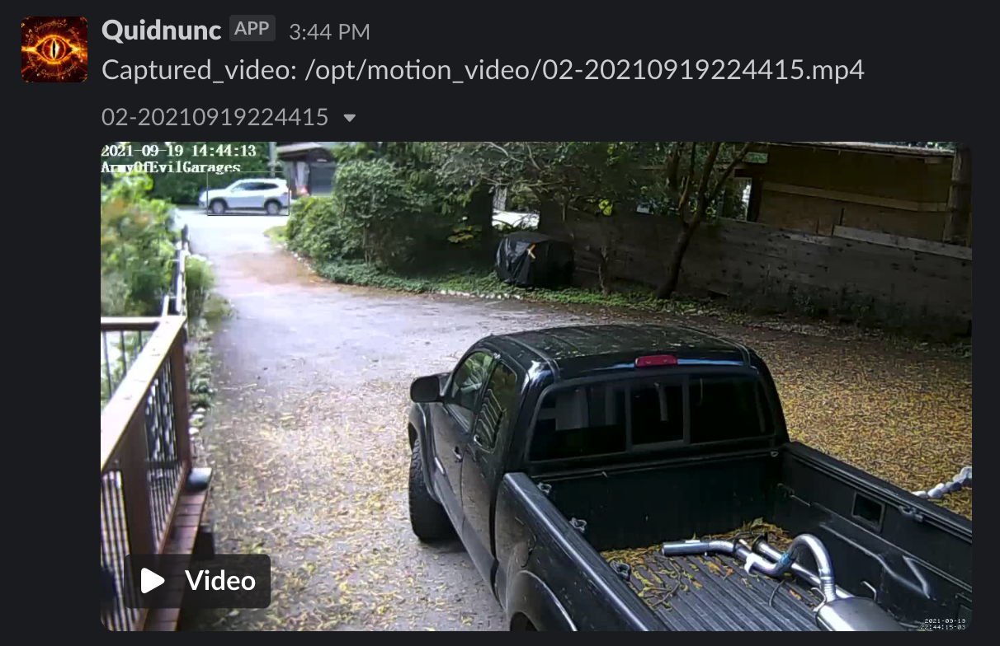
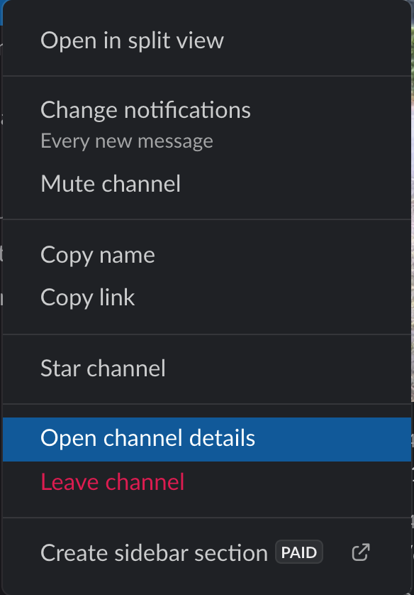
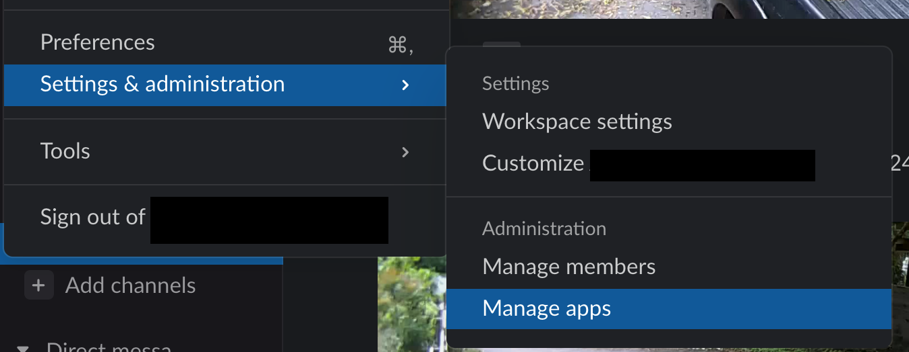

Quidnunc2
=========

#### Containerized video surveillance for the lazy dev.

Quidnunc is a quick and easy way to hook up cheap-ass MP4/MJPG/whatever cameras on your
network and to watch for interesting activity, notifying you via slack when something
actually happens. It doesn't use crazy AI/ML, doesn't require a $1500+++ graphics card, and
won't boil you alive if you're sitting near your server. It just pings you whenever something
moves inside the FOV of your surveillance cameras.

Installation
------------

There isn't any. Just run the docker-compose.yml
in docker desktop for local use, or on your server, or 
what-evs.

I'll be adding Nomad setup soon as well. K8S or even K3S
is a PITA, so I'll leave that for somebody else to fettle with.

Configuration
-------------

At it's base, Quidnunc (english, noun: A nosy neighbour) is a video
surveillance stack built upon the [motion project](https://motion-project.github.io/). 
Quidnunc takes care of setting up the runtime, running the service, and giving you an
easy way to notify yourself of events and videos using Slack.

### Setting up Cameras:

In the `motion_configs/cameras` folder, there is an example configuration file, which
has a minimal set of configuration values. You can probably just modify the contents
and save it as `$camera_name.conf` and have a working configuration. The syntax and options
are all described on the motion documentation page at
[motion project docs](https://motion-project.github.io/motion_config.html).

### Setting up the motion config

In the `motion_configs/motion.config` file is the base configuration. You can probably
leave this set with just the defaults, but it follows the same syntax as the camera configs. 
Note that camera configurations ALWAYS over-ride the global config for that camera.

### Configuring the docker env

There is an env.example file that contains all the environment variables that need to
be set for the service to function. The _values_ however all come from the following
section; configuring slack...

### Setting up Slack

Here is a 10-step program for getting your surveillance system uploading to slack:

1. Create a new channel for your camera to send messages to
2. Right click that channel and click on the "channel details" option, which will reveal 
   a channel ID with a "copy" link beside it. Take note of this channel ID, as it is the
   `SLACK_CHANNELS` value you'll need later on in the `.env` file.

3. Click the dropdown beside your Slack name, and choose the Settings/Admin->Manage Apps
   option, which will take you to your Slack admin webpage. Click "*build*" in the top right,
   and select "*Create New App*".

4. Under features and functionality, select "*Incoming Webhooks*". Enable it.
5. Copy down the Webhook URL and paste it into the `.env` file as `SLACK_NOTIFY_WEBHOOK`.
6. Click "*OAuth & Permissions*" and Grab your OAuth2 token, and paste it into the `.env`
   file as `SLACK_OAUTH_BEARER`.
7. At the bottom of the same page, select "*Add an OAuth scope*" and add `files:write` and 
   `incoming-webhook`.
8. Click the "*reinstall to workspace*" option near the top of the page to deploy the new
   permissions.
9. Go back to your Slack Chat App (you're all done setting up ), and in the channel you 
   created in step 1, type `/invite @your-bot-name`.

That's it; you're ready to go.

### Running Quidnunc

At this point, `docker compose up` should get things running. More advanced configurations are left
as an exercise for the end-user.

*Copyright 2021 ArmyOfEvilRobots. All rights reserved.*
